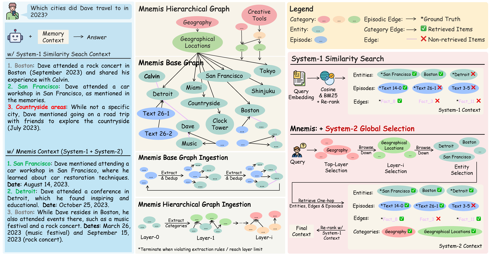
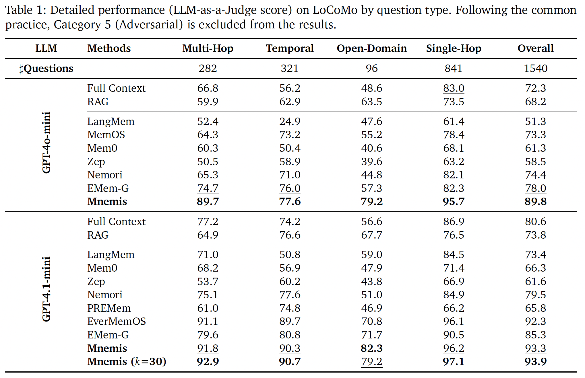
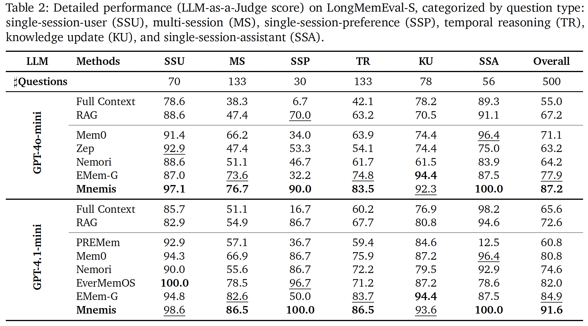
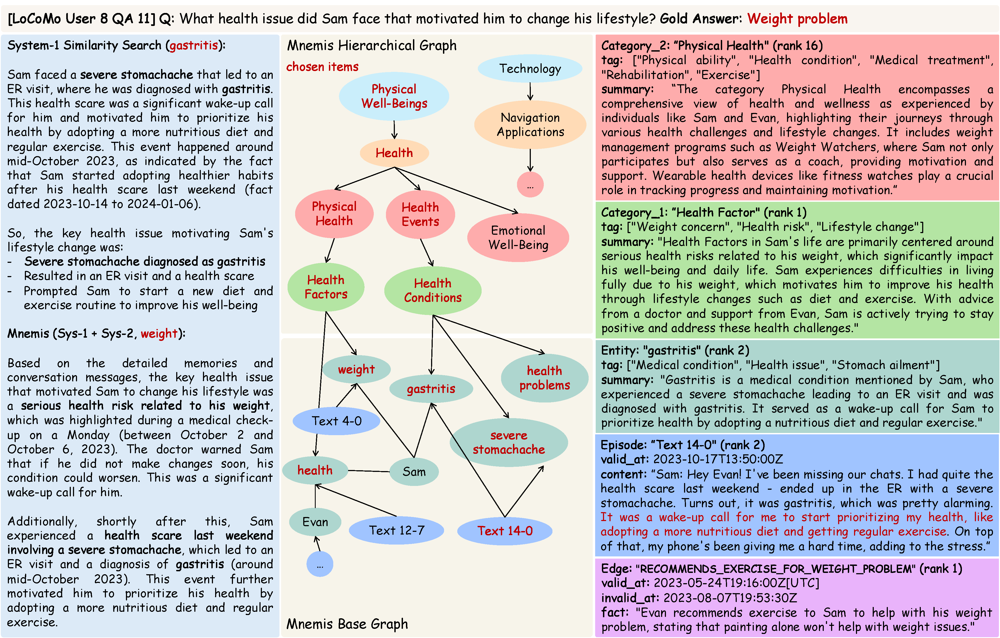
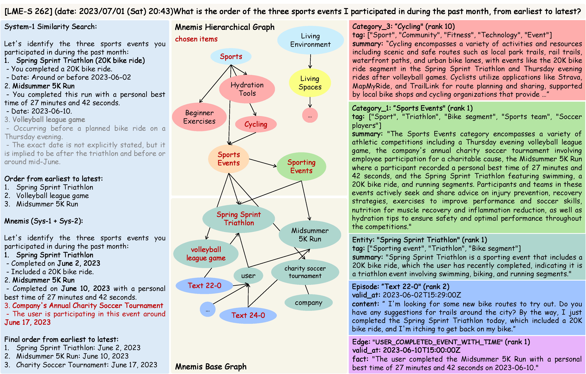

# Mnemis: Dual-Route Retrieval on Hierarchical Graphs for Long-Term LLM Memory
<div align="center" style="line-height: 1;">
  <a href="LICENSE" style="margin: 2px;">
    
  </a>
  <a href="https://arxiv.org/abs/2602.15313" style="margin: 2px;">
    
  </a>
  <a href="https://huggingface.co/papers/2602.15313" style="margin: 2px;">
    
  </a>
  <br>
</div>

## 1. Introduction
This is official repostory of paper "Mnemis: Dual-Route Retrieval on Hierarchical Graphs for Long-Term LLM Memory"

> **Abstract**: AI Memory, specifically how models organizes and retrieves historical messages,  becomes increasingly valuable to Large Language Models (LLMs), yet existing methods (RAG and Graph-RAG) primarily retrieve memory through similarity-based mechanisms. While efficient, such System-1-style retrieval struggles with scenarios that require global reasoning or comprehensive coverage of all relevant information. In this work, We propose Mnemis, a novel memory framework that integrates System-1 similarity search with a complementary System-2 mechanism, termed Global Selection. Mnemis organizes memory into a base graph for similarity retrieval and a hierarchical graph that enables top-down, deliberate traversal over semantic hierarchies. By combining the complementary strength from both retrieval routes, Mnemis retrieves memory items that are both semantically and structurally relevant. Mnemis achieves state-of-the-art performance across all compared methods on long-term memory benchmarks, scoring 93.9 on LoCoMo and 91.6 on LongMemEval-S using GPT-4.1-mini.

**Key Contributions**:
1. We introduce Mnemis, a novel framework that integrates System-1 similarity search with System-2 global selection to perform both semantic retrieval and deliberate, top-down reasoning over memory;
2. We improve the base graph extraction and construct a hierarchical graph for global selection, guided by Minimum Concept Abstraction, Many-to-Many Mapping, and Compression Efficiency Constraint to maintain hierarchical quality;
3. We perform comprehensive experiments to demonstrate the effectiveness of Mnemis. Mnemis achieves SOTA performance across all compared methods on long-term memory benchmarks, scoring 93.9 on LoCoMo and 91.6 on LongMemEval-S using GPT-4.1-mini.

## 2. Framework
Mnemis constructs two major components: a base graph and a hierarchical graph and two key memory retrieval mechanisms: System-1 Similarity Search and System-2 Global Selection.
<p align="center">
  
</p>

## 3. Evaluation Results
LoCoMo Results:
<p align="center">
  
</p>

LongMemEval-S Results:
<p align="center">
  
</p>

## 4. Case Studies
LoCoMo User 8 QA 11:
<p align="center">
  
</p>

LongMemEval-S QA 262:
<p align="center">
  
</p>

## 5. Reproduction
We implement Menmis based on [Graphiti](https://github.com/getzep/graphiti). The core prompts used in our system are provided in the Appendix of the paper.

Evaluation results, along with the memory contexts generated by Mnemis, are available in the `results` directory. The implementation of global selection is provided in `global_selection`.

## 6. Citation

If you find this work useful, please cite it as follows:
```
@misc{tang2026mnemisdualrouteretrievalhierarchical,
      title={Mnemis: Dual-Route Retrieval on Hierarchical Graphs for Long-Term LLM Memory}, 
      author={Zihao Tang and Xin Yu and Ziyu Xiao and Zengxuan Wen and Zelin Li and Jiaxi Zhou and Hualei Wang and Haohua Wang and Haizhen Huang and Weiwei Deng and Feng Sun and Qi Zhang},
      year={2026},
      eprint={2602.15313},
      archivePrefix={arXiv},
      primaryClass={cs.CL},
      url={https://arxiv.org/abs/2602.15313}, 
}
```
